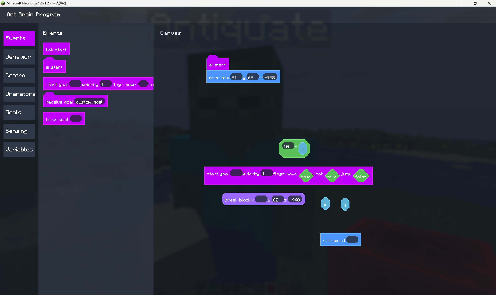

<p align="center">
  
</p>
<h1>LittleAnt</h1>
<hr>
<p align="center">
    <a href="https://github.com/Tianyang928/littleant-26.1.2/issues">Report Bug</a> 
    ·
    <a href="https://github.com/Tianyang928/littleant-26.1.2/releases">View Release</a>
</p>

This is a Minecraft 1.21.1 and 26.1.2 Neoforge mod.

**Ant** is the new entity added in this mod. It's able to break blocks, set blocks, craft things, operate inventories, just like players. 

And the most important thing is that its **AI can be programmed in-game** by players.

I tried to make the programming GUI as close as possible to [Scratch](https://scratch.mit.edu/).

Press `right-click` to open the Ant Entity's inventory.

Press `Shift + right-click` to open the Ant Entity's programming GUI.

## LittleAnt DSL

The `/antloadscript` command and the in-game program editor also accept a small,
Python-like DSL. It is compiled into the module graph; it is not
arbitrary Python and cannot import libraries or access the filesystem.

```python
@tick_start
def main():
    if food_level() < 8:
        say("I need food")
    step_forward(1)
```

## A Little Tip
I highly recommand you use English instead of Chinese to program the Ant. Because some of the Chinese characters are relatively vague because of the screen resolution.

## Future Features

- Add more preset of Ant AI using those scratch-like modules.
- Add more containers that the Ant can operate (anvil, enchanting table, for example).
- Improve the programming GUI's appearance.
- Add carrier that the Ant can use.
- Add evolution system, so that the Ant population can evolve over time.
- (Maybe the most important) the zoom function of canvas.
