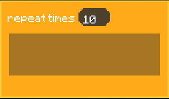
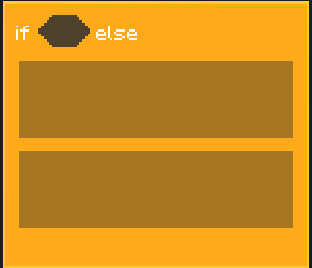

# LittleAnt AI API

Generated from `ModuleRegistry` (the single source of truth). The DSL is restricted and is not a Python interpreter.

## Prerequisites

### Goal Scheduling

`foreground goal` is the foreground goal queue: goals execute in submission order (FIFO), and the next goal starts only after the current one completes. It is suitable for tasks that must be completed continuously, such as mining, moving to a target, and crafting. A `background goal` is a background task that competes according to its priority and can run in parallel with other goals. `move_flag`, `look_flag`, and `jump_flag` indicate the Goal resources it occupies; the scheduler arbitrates when resources conflict. In general, a higher numeric value means higher priority.

Strings beginning with `vanilla:` identify **vanilla goals**. They are not Java methods that can be executed directly; they are string protocols recognized by the goal scheduler, such as `vanilla:break_block,x,y,z` and `vanilla:set_block,x,y,z`. Therefore, the return values of goal reporters such as `break_block_*`, `set_block_*`, crafting, container, and attack reporters are usually comma-separated string parameter lists intended for use with `submit_foreground_goal` or `submit_background_goal`.

### Categories

- `event`: Program entry points and goal lifecycle events (`hat`/`command`).
- `behavior`: Immediate body actions, such as moving, turning, speaking, and jumping.
- `control`: Execution-flow control, such as conditions, repetition, and loops.
- `operator`: Calculations, comparisons, and string operations that produce values.
- `goal`: Submission and inspection of goals that can execute over time.
- `sense`: Reading entity, world, inventory, and pheromone state.
- `variables`: Reading and writing blackboard variables and lists.

### BlockShape and Connections
<p>
  
</p>

- `HAT` is an entry hat block and can only be the starting point of a script chain.

<p>
  
</p>

- `COMMAND` is a stack block that performs an action and can connect to subsequent commands through `next`.

<p>
  
  
</p>

- `C_SHAPE` / `E_SHAPE` are control blocks that wrap child scripts: the `body` input of `if`, `repeat`, and `while` should connect to another command chain, while `if_else` has two branches.

<p>
  
</p>

- `REPORTER` is a rounded or octagonal block that returns a value.

<p>
  
</p>

- `BOOLEAN` is a Boolean hexagonal block. A `BOOLEAN` can only connect to Boolean inputs.

Except for `BOOLEAN`, `TEXT`, `NUMBER`, and `LIST` are all passed as strings at runtime, so they can be nested or converted into one another. For example, a coordinate list `x,y,z` can be passed as text to a goal module. Use a `BOOLEAN` reporter only when a true/false judgment is required, such as `greater_than` or `has_item_in_inventory`.

### Return Value Conventions

- `sense` reporters usually return text; coordinates use `x,y,z`, entities use numeric IDs, and lists use comma-separated text.
- Arithmetic reporters return text that can be parsed as a number.
- `goal` reporters return a vanilla goal string protocol or a Boolean value representing the goal state.
- `COMMAND` and `HAT` do not produce connectable return values.

## Example

```python
@tick_start
def main():
    say("hello")
```

## Modules

### `tick_start`

Category: `event` -- Shape: `HAT`

Parameters: none

Description: Entry point that is invoked every game tick. Use this for continuous monitoring, periodic checks, or reactive behaviors that need to run on every tick cycle.

### `ai_start`

Category: `event` -- Shape: `HAT`

Parameters: none

Description: Entry point that is called exactly once when the AI initializes (e.g., when exiting the programming interface or entering the game). Use this for one-time setup, initialization, or launching initial goals.

### `submit_foreground_goal`

Category: `event` -- Shape: `COMMAND`

Parameters:
- `goal` (`TEXT`), default ``

Description: Submits a goal to the foreground queue, which executes sequentially in FIFO order. Foreground goals block subsequent foreground goals until completion and may suspend conflicting background tasks.

Return: No value. The `goal` text is interpreted by the goal scheduler; vanilla goal reporters return the protocol string passed here.

### `submit_background_goal`

Category: `event` -- Shape: `COMMAND`

Parameters:
- `goal` (`TEXT`), default ``
- `priority` (`NUMBER`), default `1`
- `move_flag` (`BOOLEAN`), default ``
- `look_flag` (`BOOLEAN`), default ``
- `jump_flag` (`BOOLEAN`), default ``

Description: Submits a goal to the background scheduler with a priority value. Background tasks run concurrently unless they conflict with each other or with an active foreground task. Higher priority tasks preempt lower priority ones when resource flags overlap. (priority: 1 preempt priority: 2)

Return: No value. The goal argument is a comma-separated vanilla/custom goal string.

### `receive_goal`

Category: `event` -- Shape: `HAT`

Parameters:
- `goal` (`TEXT`), default `custom_goal`

Description: Entry point triggered when a custom goal with a matching name is submitted via `submit_foreground_goal` or `submit_background_goal`. The `goal` parameter filters which submitted goals activate this block.

### `goal_tick_start`

Category: `event` -- Shape: `HAT`

Parameters:
- `goal` (`TEXT`), default `custom_goal`

Description: Entry point that is called every tick while a matching custom goal is active. Unlike `receive_goal` which fires once upon goal submission, this block runs repeatedly each tick for the duration of the goal's execution.

### `finish_current_goal`

Category: `event` -- Shape: `COMMAND`

Parameters: none

Description: Immediately terminates the currently executing task in the current branch. This sets a finish flag that causes the task to stop at the end of the current tick, bypassing any pending foreground goals that were submitted earlier.

### `finish_current_goal_delay`

Category: `event` -- Shape: `COMMAND`

Parameters: none

Description: Requests termination of the current task after all previously submitted foreground goals have completed. Unlike `finish_current_goal` which stops immediately, this waits for the foreground queue to drain before finishing the task.

### `move_to_xyz`

Category: `behavior` -- Shape: `COMMAND`

Parameters:
- `x` (`NUMBER`), default `0`; required
- `y` (`NUMBER`), default `0`; required
- `z` (`NUMBER`), default `0`; required

Description: Submits a foreground movement task that navigates the ant to the specified world coordinates using pathfinding. Blocks subsequent foreground actions until the ant reaches the destination or the path is unreachable.

### `move_to_blockpos`

Category: `behavior` -- Shape: `COMMAND`

Parameters:
- `blockpos` (`LIST`), default ``

Description: Submits a foreground movement task using a list-based coordinate format `x, y, z`. Behaves identically to `move_to_xyz` but accepts coordinates as a single list parameter.

### `step_forward`

Category: `behavior` -- Shape: `COMMAND`

Parameters:
- `distance` (`NUMBER`), default `1`

Description: Submits a foreground movement task that moves the ant forward by the specified distance in the direction it is currently facing. Uses pathfinding to navigate the short distance.

### `look_at_xyz`

Category: `behavior` -- Shape: `COMMAND`

Parameters:
- `x` (`NUMBER`), default `0`; required
- `y` (`NUMBER`), default `0`; required
- `z` (`NUMBER`), default `0`; required

Description: Sets the ant's head rotation to face the specified world coordinates. This is an instantaneous behavior update applied via the blackboard, not a goal-based task.

### `look_at_blockpos`

Category: `behavior` -- Shape: `COMMAND`

Parameters:
- `blockpos` (`LIST`), default ``

Description: Sets the ant's head rotation to face the specified coordinates given as a list `x, y, z`. Behaves identically to `look_at_xyz` but accepts coordinates in list format.

### `rotate`

Category: `behavior` -- Shape: `COMMAND`

Parameters:
- `angle` (`NUMBER`), default `45`

Description: Rotates the ant's yaw by the specified angle in degrees. Positive values rotate clockwise, negative values rotate counterclockwise. Applied instantly via the blackboard.

### `say`

Category: `behavior` -- Shape: `COMMAND`

Parameters:
- `message` (`TEXT`), default ``

Description: Makes the ant display a chat message above its head. This is an instantaneous behavior applied via the blackboard.

### `switch_inventory_slot`

Category: `behavior` -- Shape: `COMMAND`

Parameters:
- `slot` (`NUMBER`), default `0`

Description: Switches the ant's selected hotbar slot to the specified index (0-8). Applied instantly via the blackboard.

### `jump`

Category: `behavior` -- Shape: `COMMAND`

Parameters: none

Description: Triggers a jump action for the ant. Applied instantly via the blackboard.

### `set_run`

Category: `behavior` -- Shape: `COMMAND`

Parameters:
- `run` (`BOOLEAN`), default ``

Description: Toggles the ant's running state on or off. When running, the ant moves at a faster speed. Applied instantly via the blackboard.

### `set_crouching`

Category: `behavior` -- Shape: `COMMAND`

Parameters:
- `crouching` (`BOOLEAN`), default ``

Description: Toggles the ant's crouching (sneaking) state on or off. Applied instantly via the blackboard.

### `repeat`

Category: `control` -- Shape: `C_SHAPE`

Parameters:
- `count` (`NUMBER`), default `10`; required
- `body` (`BLOCK`), default ``

Description: Executes the attached body block a specified number of times sequentially. The loop body runs to completion for each iteration before the next one begins.

### `if`

Category: `control` -- Shape: `C_SHAPE`

Parameters:
- `condition` (`BOOLEAN`), default ``; required
- `body` (`BLOCK`), default ``

Description: Conditionally executes the attached body block only when the condition evaluates to true. Skips the body entirely if the condition is false.

### `if_else`

Category: `control` -- Shape: `E_SHAPE`

Parameters:
- `condition` (`BOOLEAN`), default ``; required
- `body_if` (`BLOCK`), default ``
- `body_else` (`BLOCK`), default ``

Description: Executes the `body_if` block when the condition is true, or the `body_else` block when the condition is false. Exactly one branch is executed.

### `while`

Category: `control` -- Shape: `C_SHAPE`

Parameters:
- `condition` (`BOOLEAN`), default ``; required
- `body` (`BLOCK`), default ``

Description: Repeatedly executes the attached body block as long as the condition remains true. Includes a built-in safety cap of 1000 iterations to prevent infinite loops.

### `add`

Category: `operator` -- Shape: `REPORTER`

Parameters:
- `a` (`NUMBER`), default `0`; required
- `b` (`NUMBER`), default `0`; required

Description: Returns the sum of two numbers.

### `subtract`

Category: `operator` -- Shape: `REPORTER`

Parameters:
- `a` (`NUMBER`), default `0`; required
- `b` (`NUMBER`), default `0`; required

Description: Returns the result of subtracting `b` from `a`.

### `multiply`

Category: `operator` -- Shape: `REPORTER`

Parameters:
- `a` (`NUMBER`), default `0`; required
- `b` (`NUMBER`), default `0`; required

Description: Returns the product of two numbers.

### `divide`

Category: `operator` -- Shape: `REPORTER`

Parameters:
- `a` (`NUMBER`), default `0`; required
- `b` (`NUMBER`), default `0`; required

Description: Returns the quotient of `a` divided by `b`. Returns 0 if `b` is zero to avoid division errors.

### `mod`

Category: `operator` -- Shape: `REPORTER`

Parameters:
- `a` (`NUMBER`), default `0`; required
- `b` (`NUMBER`), default `0`; required

Description: Returns the remainder of `a` divided by `b`. Returns 0 if `b` is zero.

### `absolute`

Category: `operator` -- Shape: `REPORTER`

Parameters:
- `number` (`NUMBER`), default `0`; required

Description: Returns the absolute (non-negative) value of a number.

### `random`

Category: `operator` -- Shape: `REPORTER`

Parameters:
- `a` (`NUMBER`), default `0`; required
- `b` (`NUMBER`), default `0`; required

Description: Returns a random floating-point number between `a` and `b`.

### `greater_than`

Category: `operator` -- Shape: `BOOLEAN`

Parameters:
- `a` (`NUMBER`), default `0`; required
- `b` (`NUMBER`), default `0`; required

Description: Returns true if `a` is strictly greater than `b`.

### `less_than`

Category: `operator` -- Shape: `BOOLEAN`

Parameters:
- `a` (`NUMBER`), default `0`; required
- `b` (`NUMBER`), default `0`; required

Description: Returns true if `a` is strictly less than `b`.

### `equal`

Category: `operator` -- Shape: `BOOLEAN`

Parameters:
- `a` (`NUMBER`), default `0`; required
- `b` (`NUMBER`), default `0`; required

Description: Returns true if `a` and `b` are numerically equal.

### `not`

Category: `operator` -- Shape: `BOOLEAN`

Parameters:
- `condition` (`BOOLEAN`), default ``; required

Description: Returns the logical negation of the input condition.

### `and`

Category: `operator` -- Shape: `BOOLEAN`

Parameters:
- `condition_a` (`BOOLEAN`), default ``; required
- `condition_b` (`BOOLEAN`), default ``; required

Description: Returns true if both conditions are true.

### `or`

Category: `operator` -- Shape: `BOOLEAN`

Parameters:
- `condition_a` (`BOOLEAN`), default ``; required
- `condition_b` (`BOOLEAN`), default ``; required

Description: Returns true if at least one of the conditions is true.

### `true`

Category: `operator` -- Shape: `BOOLEAN`

Parameters: none

Description: Constant boolean reporter that always returns true.

### `false`

Category: `operator` -- Shape: `BOOLEAN`

Parameters: none

Description: Constant boolean reporter that always returns false.

### `join_string_list`

Category: `operator` -- Shape: `REPORTER`

Parameters:
- `strings` (`LIST`), default ``

Description: Concatenates all strings in a comma-separated list into a single string.

### `join_string_str`

Category: `operator` -- Shape: `REPORTER`

Parameters:
- `string1` (`TEXT`), default ``
- `string2` (`TEXT`), default ``

Description: Concatenates two text strings together.

### `contain_str`

Category: `operator` -- Shape: `BOOLEAN`

Parameters:
- `source` (`TEXT`), default ``
- `target` (`TEXT`), default ``

Description: Returns true if the source string contains the target substring.

### `break_block_xyz`

Category: `goal` -- Shape: `REPORTER`

Parameters:
- `x` (`NUMBER`), default `0`; required
- `y` (`NUMBER`), default `0`; required
- `z` (`NUMBER`), default `0`; required

Description: Constructs a goal string for breaking a block at the specified coordinates. When submitted, the ant will navigate to and break the target block.

Return: TEXT goal protocol `vanilla:break_block,x,y,z`.

### `break_block_blockpos`

Category: `goal` -- Shape: `REPORTER`

Parameters:
- `blockpos` (`LIST`), default ``

Description: Constructs a goal string for breaking a block at coordinates given as a list `x, y, z`. Behaves identically to `break_block_xyz`.

### `set_block_xyz`

Category: `goal` -- Shape: `REPORTER`

Parameters:
- `x` (`NUMBER`), default `0`; required
- `y` (`NUMBER`), default `0`; required
- `z` (`NUMBER`), default `0`; required

Description: Constructs a goal string for placing a block at the specified coordinates. The ant will navigate to the location and place a block.

Return: TEXT goal protocol `vanilla:set_block,x,y,z`.

### `set_block_blockpos`

Category: `goal` -- Shape: `REPORTER`

Parameters:
- `blockpos` (`LIST`), default ``

Description: Constructs a goal string for placing a block at coordinates given as a list `x, y, z`. Behaves identically to `set_block_xyz`.

### `use_crafting_table_xyz`

Category: `goal` -- Shape: `REPORTER`

Parameters:
- `amount` (`NUMBER`), default `1`; required
- `recipe_slots` (`TEXT`), default `minecraft:air`; required

Description: Constructs a goal string for crafting items using a 3x3 crafting table at the specified position. Includes the recipe item slots and output amount.

### `use_crafting_table_blockpos`

Category: `goal` -- Shape: `REPORTER`

Parameters:
- `amount` (`NUMBER`), default `1`; required
- `recipe_slots` (`TEXT`), default `minecraft:air`; required

Description: Constructs a goal string for crafting items using a 3x3 crafting table at coordinates given as a list. Behaves identically to `use_crafting_table_xyz`.

### `use_inventory_crafting`

Category: `goal` -- Shape: `REPORTER`

Parameters:
- `amount` (`NUMBER`), default `1`; required
- `recipe_slots` (`TEXT`), default `minecraft:air`; required

Description: Constructs a goal string for crafting items using the 2x2 inventory crafting grid. Includes the recipe item slots and output amount.

### `better_float`

Category: `goal` -- Shape: `REPORTER`

Parameters: none

Description: Constructs a goal string for a specialized floating/swimming behavior. Used when the ant needs to navigate through water or avoid drowning.

### `use_container_xyz`

Category: `goal` -- Shape: `REPORTER`

Parameters:
- `x` (`NUMBER`), default `0`; required
- `y` (`NUMBER`), default `0`; required
- `z` (`NUMBER`), default `0`; required
- `put_in` (`BOOLEAN`), default ``; required
- `item` (`TEXT`), default `minecraft:stone`; required
- `slot` (`NUMBER`), default `0`; required
- `amount` (`NUMBER`), default `1`; required

Description: Constructs a goal string for interacting with a container (e.g., chest) at the specified coordinates. Can either put an item into or take an item from a specific container slot.

### `use_container_blockpos`

Category: `goal` -- Shape: `REPORTER`

Parameters:
- `blockpos` (`NUMBER`), default `0`; required
- `put_in` (`BOOLEAN`), default ``; required
- `item` (`TEXT`), default `minecraft:stone`; required
- `slot` (`NUMBER`), default `0`; required
- `amount` (`NUMBER`), default `1`; required

Description: Constructs a goal string for interacting with a container at coordinates given as a list. Behaves identically to `use_container_xyz`.

### `melee_attack`

Category: `goal` -- Shape: `REPORTER`

Parameters:
- `target` (`NUMBER`), default ``; required

Description: Constructs a goal string for performing a melee attack against a specific entity identified by its **entity ID**. The ant will pathfind toward and attack the target.

Return: TEXT goal protocol containing the target **entity ID**.

### `clear_goal`

Category: `goal` -- Shape: `COMMAND`

Parameters: none

Description: Clears all active and queued goals from both the foreground and background schedulers. Effectively resets the ant's current task state.

### `already_has_goal`

Category: `goal` -- Shape: `BOOLEAN`

Parameters:
- `goal` (`TEXT`), default ``

Description: Returns true if the specified goal name is already present in the scheduler (either active or queued). Useful for preventing duplicate goal submissions.

### `already_has_goal_at_priority`

Category: `goal` -- Shape: `BOOLEAN`

Parameters:
- `goal` (`TEXT`), default ``
- `priority` (`NUMBER`), default `1`; required

Description: Returns true if the specified goal is already present in the scheduler at the given priority level. Allows checking for goal existence with priority filtering.

### `use_item`

Category: `goal` -- Shape: `REPORTER`

Parameters: none

Description: Constructs a goal string for using the currently held item in the main hand. The ant will perform the item use action (e.g., eating food, placing blocks).

Return: TEXT vanilla goal protocol for the item-use operation.

### `use_block_xyz`

Category: `goal` -- Shape: `REPORTER`

Parameters:
- `x` (`NUMBER`), default `0`; required
- `y` (`NUMBER`), default `0`; required
- `z` (`NUMBER`), default `0`; required
- `face` (`TEXT`), default `up`
- `held_item` (`BOOLEAN`), default ``

Description: Constructs a goal string for interacting with (right-clicking) a block at the specified coordinates. The `face` parameter specifies which face to interact with, and `held_item` determines whether to use the held item.

### `use_block_blockpos`

Category: `goal` -- Shape: `REPORTER`

Parameters:
- `blockpos` (`LIST`), default ``
- `face` (`TEXT`), default `up`
- `held_item` (`BOOLEAN`), default ``

Description: Constructs a goal string for interacting with a block at coordinates given as a list. Behaves identically to `use_block_xyz`.

### `interact_entity`

Category: `goal` -- Shape: `REPORTER`

Parameters:
- `target` (`NUMBER`), default `-1`; required
- `held_item` (`BOOLEAN`), default ``; required

Description: Constructs a goal string for interacting with (right-clicking) an entity identified by its **entity ID**. The `held_item` parameter determines whether to use the held item during interaction.

### `health`

Category: `sense` -- Shape: `REPORTER`

Parameters: none

Description: Returns the ant's current health value as a number.

### `food_level`

Category: `sense` -- Shape: `REPORTER`

Parameters: none

Description: Returns the ant's current food/hunger level as a number.

### `x`

Category: `sense` -- Shape: `REPORTER`

Parameters: none

Description: Returns the ant's current X coordinate in the world.

### `y`

Category: `sense` -- Shape: `REPORTER`

Parameters: none

Description: Returns the ant's current Y coordinate in the world.

### `z`

Category: `sense` -- Shape: `REPORTER`

Parameters: none

Description: Returns the ant's current Z coordinate in the world.

### `pos`

Category: `sense` -- Shape: `REPORTER`

Parameters: none

Description: Returns the ant's current position as a comma-separated string in the format `x,y,z`.

### `distance_to_xyz`

Category: `sense` -- Shape: `REPORTER`

Parameters:
- `x` (`NUMBER`), default `0`; required
- `y` (`NUMBER`), default `0`; required
- `z` (`NUMBER`), default `0`; required

Description: Returns the Euclidean distance from the ant's current position to the specified world coordinates.

### `distance_to_blockpos`

Category: `sense` -- Shape: `REPORTER`

Parameters:
- `blockpos` (`LIST`), default ``

Description: Returns the Euclidean distance from the ant's current position to the coordinates given as a list `x, y, z`.

### `get_block_xyz`

Category: `sense` -- Shape: `REPORTER`

Parameters:
- `x` (`NUMBER`), default `0`; required
- `y` (`NUMBER`), default `0`; required
- `z` (`NUMBER`), default `0`; required

Description: Returns the block ID (as a string) at the specified world coordinates.

### `get_block_blockpos`

Category: `sense` -- Shape: `REPORTER`

Parameters:
- `blockpos` (`LIST`), default ``

Description: Returns the block ID (as a string) at the coordinates given as a list `x, y, z`.

### `get_entity_at_xyz`

Category: `sense` -- Shape: `REPORTER`

Parameters:
- `x` (`NUMBER`), default `0`; required
- `y` (`NUMBER`), default `0`; required
- `z` (`NUMBER`), default `0`; required

Description: Returns the **entity ID** of the entity located at the specified world coordinates, or a default value if no entity is present.

### `get_entity_at_blockpos`

Category: `sense` -- Shape: `REPORTER`

Parameters:
- `blockpos` (`LIST`), default ``

Description: Returns the **entity ID** of the entity located at the coordinates given as a list `x, y, z`.

### `get_entity_pos`

Category: `sense` -- Shape: `REPORTER`

Parameters:
- `id` (`NUMBER`), default ``

Description: Returns the position of the entity with the specified ID as a comma-separated string `x,y,z`.

### `has_item_in_inventory`

Category: `sense` -- Shape: `BOOLEAN`

Parameters:
- `item` (`TEXT`), default `minecraft:stone`

Description: Returns true if the ant has the specified item anywhere in its inventory.

### `get_item_in_inventory`

Category: `sense` -- Shape: `REPORTER`

Parameters:
- `slot` (`NUMBER`), default `0`; required

Description: Returns the item name, like `minecraft:stone`, in the specified inventory slot.

### `time`

Category: `sense` -- Shape: `REPORTER`

Parameters: none

Description: Returns the current world time (in ticks).

### `is_hurt`

Category: `sense` -- Shape: `BOOLEAN`

Parameters: none

Description: Returns true if the ant is currently taking damage or has recently been hurt.

### `is_on_fire`

Category: `sense` -- Shape: `BOOLEAN`

Parameters: none

Description: Returns true if the ant is currently on fire.

Return: BOOLEAN (`true` or `false`).

### `is_in_water`

Category: `sense` -- Shape: `BOOLEAN`

Parameters: none

Description: Returns true if the ant is currently in water.

### `is_under_water`

Category: `sense` -- Shape: `BOOLEAN`

Parameters: none

Description: Returns true if the ant is fully submerged underwater.

### `last_hurt_by_entity`

Category: `sense` -- Shape: `REPORTER`

Parameters: none

Description: Returns the **entity ID** of the last entity that damaged the ant.

### `find_block`

Category: `sense` -- Shape: `REPORTER`

Parameters:
- `block` (`TEXT`), default `minecraft:stone`

Description: Searches for the nearest block of the specified type and returns its position as a comma-separated string `x,y,z`.

Return: TEXT/LIST-compatible coordinate string `x,y,z`, or an empty string when no block is found.

### `find_entity`

Category: `sense` -- Shape: `REPORTER`

Parameters:
- `entity` (`TEXT`), default `minecraft:pig`

Description: Searches for the nearest entity of the specified type and returns its **entity ID**.

Return: TEXT containing a numeric **entity ID**, or an empty string when no entity is found.

### `find_block_entity`

Category: `sense` -- Shape: `REPORTER`

Parameters:
- `block_entity` (`TEXT`), default `minecraft:chest`

Description: Searches for the nearest block entity (e.g., chest, furnace) of the specified type and returns its position.

### `find_pheromone`

Category: `sense` -- Shape: `REPORTER`

Parameters:
- `pheromone` (`TEXT`), default `home`

Description: Searches for the nearest pheromone trail of the specified type and returns its position. Used for ant colony navigation and communication.

Return: TEXT/LIST-compatible coordinate string `x,y,z`, or an empty string when no trail is found.

### `find_drop`

Category: `sense` -- Shape: `REPORTER`

Parameters:
- `drop` (`TEXT`), default `minecraft:stone`

Description: Searches for the nearest dropped item of the specified type and returns its position.

### `get_surrounding_pheromone_types`

Category: `sense` -- Shape: `REPORTER`

Parameters: none

Description: Returns a comma-separated list of all pheromone types detected in the ant's surrounding area.

### `find_nearest_entity`

Category: `sense` -- Shape: `REPORTER`

Parameters: none

Description: Returns the **entity ID** of the nearest entity to the ant, regardless of type.

### `has_item_in_container_xyz`

Category: `sense` -- Shape: `BOOLEAN`

Parameters:
- `x` (`NUMBER`), default `0`; required
- `y` (`NUMBER`), default `0`; required
- `z` (`NUMBER`), default `0`; required
- `item` (`TEXT`), default `minecraft:stone`

Description: Returns true if the specified item exists in the container (e.g., chest) at the given coordinates.

### `has_item_in_container_blockpos`

Category: `sense` -- Shape: `BOOLEAN`

Parameters:
- `blockpos` (`LIST`), default ``
- `item` (`TEXT`), default `minecraft:stone`

Description: Returns true if the specified item exists in the container at the coordinates given as a list `x, y, z`.

### `get_item_in_container_xyz`

Category: `sense` -- Shape: `REPORTER`

Parameters:
- `x` (`NUMBER`), default `0`; required
- `y` (`NUMBER`), default `0`; required
- `z` (`NUMBER`), default `0`; required
- `slot` (`NUMBER`), default `0`; required

Description: Returns the item name, like `minecraft:stone`, in the specified slot of the container at the given coordinates.

### `get_item_in_container_blockpos`

Category: `sense` -- Shape: `REPORTER`

Parameters:
- `blockpos` (`LIST`), default ``
- `slot` (`NUMBER`), default `0`; required

Description: Returns the item name, like `minecraft:stone`, in the specified slot of the container at the coordinates given as a list `x, y, z`.

### `get_speed`

Category: `sense` -- Shape: `REPORTER`

Parameters: none

Description: Returns the ant's current movement speed as a number.

### `set_variable`

Category: `variables` -- Shape: `COMMAND`

Parameters:
- `name` (`TEXT`), default ``
- `value` (`NUMBER`), default `0`

Description: Sets a temporary variable with the given name to the specified numeric value. Temporary variables are scoped to the current goal execution and are cleared when the goal finishes.

### `get_variable`

Category: `variables` -- Shape: `REPORTER`

Parameters:
- `name` (`TEXT`), default ``

Description: Returns the value of a variable by name. Returns the temporary value if set, otherwise falls back to the permanent value.

### `set_variable_permanent`

Category: `variables` -- Shape: `COMMAND`

Parameters:
- `name` (`TEXT`), default ``

Description: Marks a variable as permanent, meaning its value persists across goal executions and is saved to the ant's persistent memory.

### `new_list`

Category: `variables` -- Shape: `COMMAND`

Parameters:
- `name` (`TEXT`), default ``

Description: Creates a new empty list with the given name. The list can store key-value pairs and is used for collecting structured data.

### `get_list`

Category: `variables` -- Shape: `REPORTER`

Parameters:
- `name` (`TEXT`), default ``

Description: Returns the entire list as a comma-separated string of its values.

### `add_list`

Category: `variables` -- Shape: `COMMAND`

Parameters:
- `name` (`TEXT`), default ``
- `list` (`LIST`), default ``

Description: Appends all values from one list to another named list.

### `add_value`

Category: `variables` -- Shape: `COMMAND`

Parameters:
- `name` (`TEXT`), default ``
- `value` (`TEXT`), default ``

Description: Appends a single value to the end of the named list.

### `set_list_kv`

Category: `variables` -- Shape: `COMMAND`

Parameters:
- `name` (`TEXT`), default ``
- `key` (`NUMBER`), default ``
- `value` (`TEXT`), default ``

Description: Sets the value at a specific numeric key index in the named list. If the key already exists, the value is overwritten.

### `set_list_list`

Category: `variables` -- Shape: `COMMAND`

Parameters:
- `name` (`TEXT`), default ``
- `list` (`LIST`), default ``

Description: Replaces the entire contents of the named list with the values from the provided list.

### `get_list_value`

Category: `variables` -- Shape: `REPORTER`

Parameters:
- `name` (`TEXT`), default ``
- `key` (`NUMBER`), default ``

Description: Returns the value stored at the specified numeric key index in the named list.

### `set_list_permanent`

Category: `variables` -- Shape: `COMMAND`

Parameters:
- `name` (`TEXT`), default ``

Description: Marks a list as permanent, meaning its contents persist across goal executions and are saved to the ant's persistent memory.

### `clear_list`

Category: `variables` -- Shape: `COMMAND`

Parameters:
- `name` (`TEXT`), default ``

Description: Removes all values from the named list, leaving it empty.
